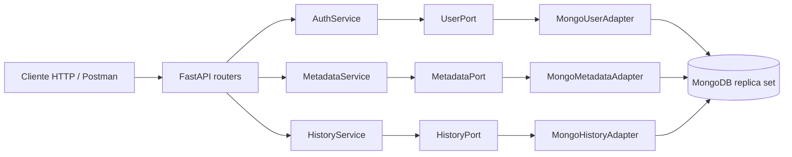
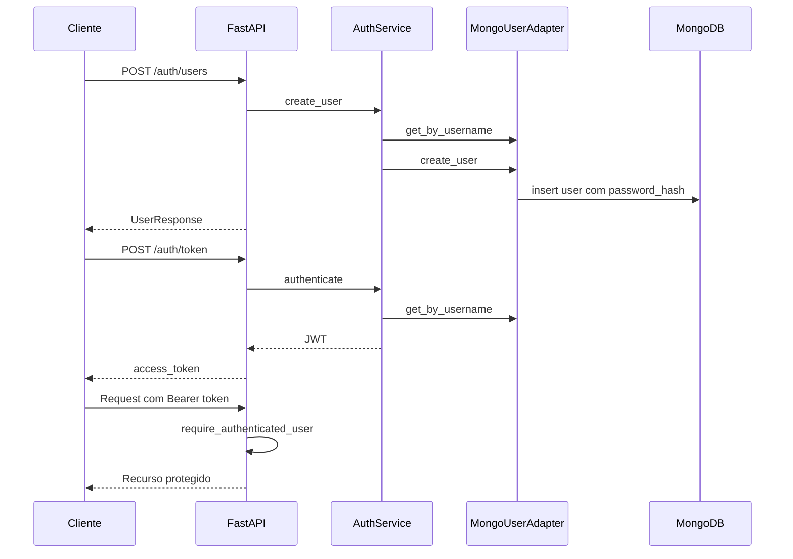
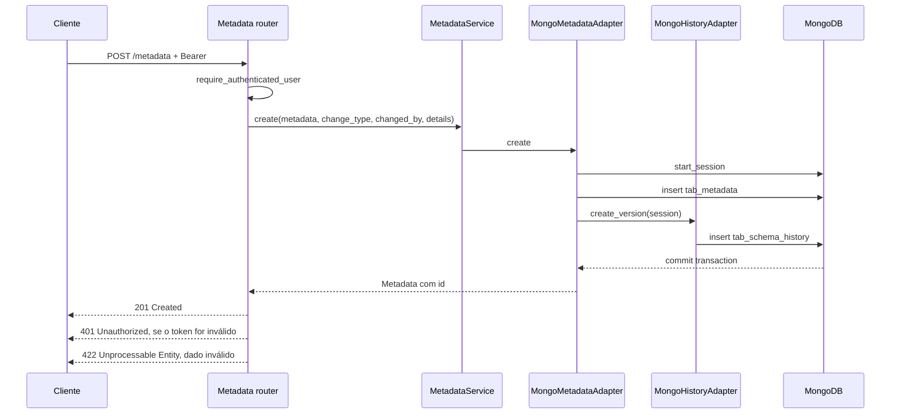
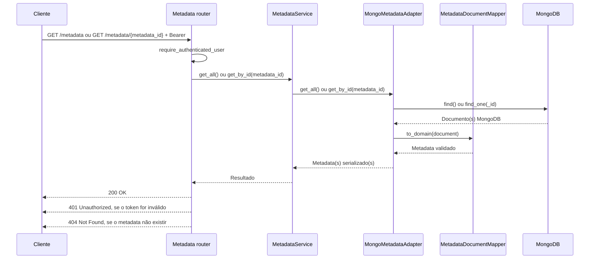
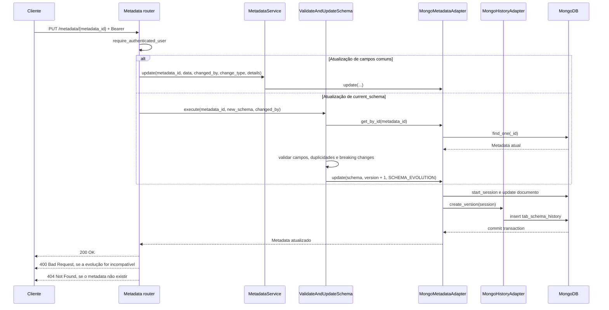

# Arquitetura

## Visão geral

O serviço utiliza uma arquitetura hexagonal, separando regras de negócio, casos de uso, interfaces externas e infraestrutura.



## Camadas

### Domínio

Localizado em `app/domain`.

- `models/metadata.py`: `Metadata`, `MetadataUpdate`, `FieldSchema` e `Storage`.
- `models/history.py`: estruturas de histórico de alterações.
- `models/security.py`: usuários, login, payload JWT e resposta de token.

Os modelos Pydantic validam os dados recebidos pela API e os documentos reconstruídos a partir do MongoDB.

### Aplicação

Localizada em `app/application`.

- `use_cases/services.py`: operações de Metadata.
- `use_cases/history_service.py`: consulta do histórico por Metadata.
- `use_cases/auth_service.py`: criação de usuários e autenticação.
- `ports/metadata_port.py`: contrato do repositório de Metadata.
- `ports/history_port.py`: contrato do repositório de histórico.
- `ports/user_port.py`: contrato do repositório de usuários.

Os casos de uso dependem apenas dos ports, não diretamente do MongoDB ou do FastAPI.

### Adapters de entrada

Localizados em `app/adapters/inbound`.

- `routers.py`: endpoints HTTP de saúde, autenticação, Metadata e histórico.
- `error_handlers.py`: exceções de domínio e handlers globais de erro.

A autenticação usa Bearer JWT. Os endpoints `/metadata` exigem um token válido; `/health`, `/auth/users` e `/auth/token` são públicos.

### Adapters de saída

Localizados em `app/adapters/outbound`.

- `metadata_adapter.py`: persiste Metadata e atualiza documentos.
- `history_adapter.py`: persiste versões do histórico.
- `user_adapter.py`: persiste usuários com senha hash.
- `schemas/metadata_document.py`: converte modelos de domínio para BSON e BSON para modelos de domínio.

## Fluxo de autenticação



As senhas nunca são armazenadas em texto puro. O hash é gerado com `pwdlib`, usando Argon2 e Bcrypt como hashers disponíveis.

## Fluxo de Metadata e histórico

O `POST /metadata` recebe um Metadata completo, salva a versão em `tab_metadata` e registra a alteração em `tab_schema_history` na mesma transação MongoDB.



A consulta `GET /metadata/{metadata_id}/histories` usa `HistoryService` e filtra os documentos de `tab_schema_history` pelo `table_id` associado ao Metadata.

## Fluxo de leitura de Metadata



## Fluxo de atualização de Metadata



## Persistência

O MongoDB precisa operar como replica set porque o salvamento de Metadata e histórico usa transações.

No Docker Compose:

- `mongo`: executa `mongod --replSet rs0`.
- `mongo-init`: inicializa o replica set `rs0`.
- `api`: conecta usando `mongodb://mongo:27017/?replicaSet=rs0`.
- `metadata-mongodb-data`: volume persistente dos dados.

## Tratamento de erros

Os handlers globais estão em `app/adapters/inbound/error_handlers.py` e retornam um formato uniforme:

```json
{
  "error": {
    "code": "validation_error",
    "message": "Request validation failed",
    "details": []
  }
}
```

Principais categorias:

- `validation_error`: payload inválido, HTTP `422`.
- `http_error`: exceções HTTP explícitas.
- `duplicate_resource`: conflito de username ou recurso, HTTP `409`.
- `database_unavailable`: falha de conexão ou operação no banco, HTTP `503`.
- `internal_error`: erro inesperado, HTTP `500`.

## Observabilidade

O middleware HTTP registra método, caminho, status e duração da requisição. Os services registram operações de Metadata e histórico sem registrar senhas, tokens ou payloads completos.

## Execução

```bash
docker compose up --build
```

A API fica disponível em `http://localhost:8000` e o Swagger em `http://localhost:8000/docs`.
